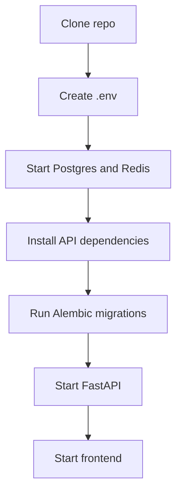

# Development Workflow

## Repo Setup

## Backend Feature Steps

1. Add or update schema in `app/schemas`.
2. Add route in `app/routes`.
3. Add handler in `app/handlers`.
4. Add business logic in `app/services`.
5. Add database access in `app/repositories`.
6. Add or update Alembic migration if persistence changes.
7. Add focused tests.

## Documentation Rule

When a new layer boundary is introduced, add a short README or architecture note before implementation spreads across the repo.
