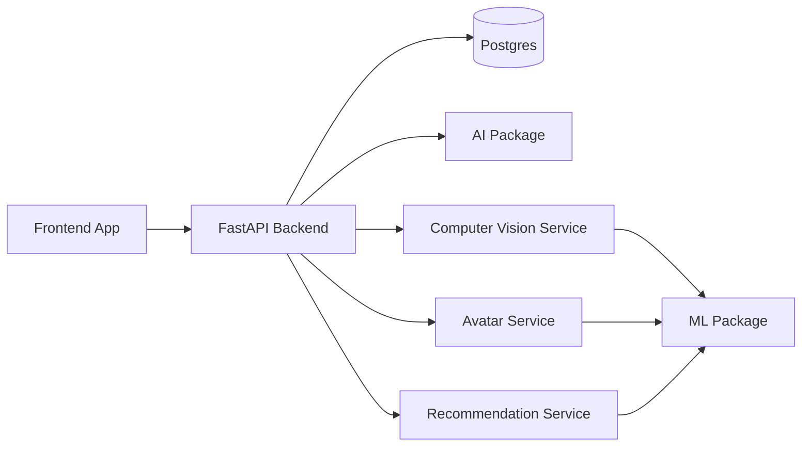
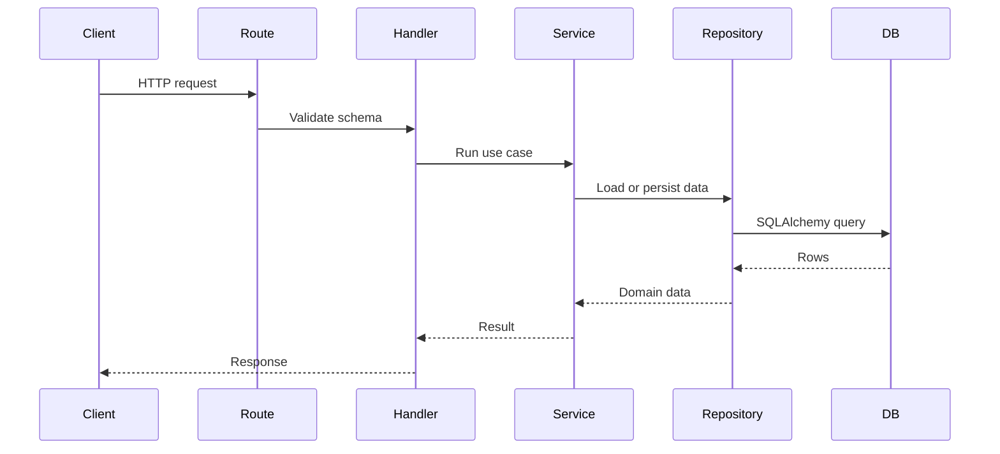
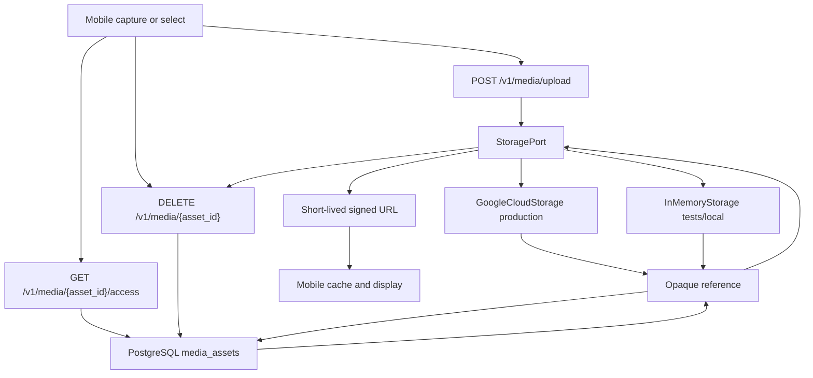

# System Architecture

## Layers

## Backend Pattern

SVEYRA backend follows route, handler, service, repository.

## Independent Boundaries

- `backend` exposes product APIs.
- `frontend` owns the user experience.
- `database` owns schema migrations.
- `ai` owns prompt and model orchestration contracts.
- `ml` owns model adapter contracts.
- `shared` owns cross-layer vocabulary and contracts.
- `services/cv` owns perception workflows.
- `services/avatar` owns 3D identity and try-on workflows.
- `services/recommendation` owns ranking and styling decisions.

## Request Rule

Routes should stay thin. Handlers coordinate schemas and status codes. Services hold business logic. Repositories are the only layer that talks directly to the database.

## Authentication

Product APIs use JWT Bearer access tokens (HS256). `POST /v1/auth/register` and `POST /v1/auth/login` are public. Login returns a short-lived access token whose `sub` is `users.id`. Protected routes take identity from `get_current_user`; they do not trust client-supplied `user_id`. Resource GET/DELETE operations require the row's `user_id` to match the authenticated user. `GET /health` and `GET /v1/profile/summary` remain public. JWT secrets come from environment (`JWT_SECRET`); do not commit real secrets. Passwords are stored only as `users.password_hash`.

Request bodies use strict schemas (`extra` fields are rejected). Collection list endpoints accept `limit` (default 50, max 100) and `offset` (default 0) and return `limit`, `offset`, and `total` alongside the items. Client validation failures return HTTP 422 with the shared error envelope (`validation_error`).

Refresh tokens, OAuth, and external identity providers are out of scope.

## Recommendations

`POST /v1/recommendations` is authenticated. Identity comes from JWT `sub`. The service loads only the caller's wardrobe metadata (including optional M18 `attributes.cv`), style-profile `preferences` / `dislikes` / `budget`, and the latest body `fit_preferences` when present. Ranking runs through provider-neutral `StylistPort` (default deterministic `StubStylist`). Image bytes and StoragePort are never used. Results are ephemeral (not written to PostgreSQL). Clients may persist an accepted candidate with the existing outfits API. A future AI/LLM adapter can replace `StylistPort` without changing the HTTP contract (`occasion` in, `item_ids` + `rationale` out).

## Garment Enrichment (Vision)

`POST /v1/wardrobe/{item_id}/enrich` is authenticated. Identity comes from JWT `sub`. `GarmentEnrichmentService` verifies wardrobe ownership, loads the linked `media_assets` row for that item (same user), reads image bytes only through `StoragePort.get(opaque reference)`, and calls `VisionPort.analyze_garment(bytes)`. Results update existing wardrobe columns only: `category`, `color`, and `attributes` JSON. No migration is required.

Confidence policy: overwrite `category` / `color` only when the corresponding confidence is ≥ `0.75`. Below that threshold, keep existing column values and store suggestions under `attributes.cv`. Never persist image bytes, signed URLs, or storage references in wardrobe attributes. Provider adapters live under `backend/app/vision/` behind `VisionPort`; routes, handlers, repositories, auth, and GCS adapters must not import provider SDKs. Default `VISION_BACKEND=stub` uses deterministic `StubVision` for tests and local runs. Real CV providers (Ollama, OpenCV, cloud vision, etc.) are deferred.

## Wardrobe Item Lifecycle

`PATCH /v1/wardrobe/{item_id}` updates owned wardrobe metadata (`category`, `color`, `brand`, `attributes`) partially. `DELETE /v1/wardrobe/{item_id}` removes the owned item after cascading linked media through existing M14 deletion semantics (`StoragePort.delete` then metadata). Soft delete is not used. Saved outfits are not cascaded; their JSON `item_ids` may retain historical references.

## Media And Object Storage Boundary

PostgreSQL stores the opaque media reference and ownership metadata; the actual image bytes live in external object storage.

Production object storage uses Google Cloud Storage behind `StoragePort`. `InMemoryStorage` remains for tests and local development when `STORAGE_BACKEND=memory`.

`POST /v1/media/upload` accepts multipart `user_id`, optional `wardrobe_item_id`, and `file`. Empty files are rejected. Bytes go through `StoragePort.put`; PostgreSQL stores only the opaque `reference`. Set `STORAGE_BACKEND=gcs` and `GCS_BUCKET_NAME` for production GCS. Default `STORAGE_BACKEND=memory` uses ephemeral `InMemoryStorage`. GCS authentication uses Application Default Credentials; do not commit service-account JSON or private keys.

`POST /v1/media` remains the metadata-only reference registration endpoint. `GET /v1/media/{asset_id}` returns metadata only; it does not stream bytes.

`GET /v1/media/{asset_id}/access` loads the asset through `MediaAssetRepository`, reads the opaque `reference` from PostgreSQL, and calls `StoragePort.create_access_url()` to return a short-lived access URL. Signed URLs are generated at request time, returned to the client, and never persisted. The API does not proxy image bytes. No public bucket is required for GCS; access uses server-generated signed URLs. `InMemoryStorage` returns non-production `memory://` URLs for tests and local development only.

`DELETE /v1/media/{asset_id}` loads metadata by `asset_id`, deletes the external object through `StoragePort.delete()` using the server-resolved opaque reference, then removes the `media_assets` row. Provider-specific deletion stays inside storage adapters. Deletion is not atomic across object storage and PostgreSQL: storage is deleted first, then the database row is committed. If storage deletion fails, the metadata row remains and the same `DELETE` can be retried. If the database commit fails after storage deletion succeeds, metadata remains while the object may already be gone; the `media_assets` row is the durable retry record because it still holds the opaque `reference`. Retrying `DELETE /v1/media/{asset_id}` is safe because `StoragePort.delete()` is idempotent when the object is already missing. M14 does not add workers, queues, outbox tables, or deletion-status columns.

### Ownership

| Layer | Owns | Does not own |
| --- | --- | --- |
| Mobile | Capture/select; future upload interaction; local cache/display | Database schema; storage-provider choice |
| Backend/API | Validation; user and wardrobe-item ownership; `media_assets` metadata; `POST /v1/media/upload`; `GET /v1/media/{asset_id}/access`; `DELETE /v1/media/{asset_id}`; `StoragePort` wiring | Image download/streaming proxy; CDN |
| PostgreSQL | `media_assets` rows: `user_id`, optional `wardrobe_item_id`, opaque `reference` | Image bytes, base64, thumbnails, provider URLs |
| Object storage | Actual image bytes | Product identity and wardrobe metadata |
| CV / image processing | Synchronous garment enrichment via `VisionPort` (`POST /v1/wardrobe/{item_id}/enrich`); reads bytes only through `StoragePort.get` | Storage provider choice; upload/delete contracts; schema migrations |

Outfits reference wardrobe item IDs, not media IDs. Images remain reachable as outfit → wardrobe item → `media_assets`.

### Provider-neutral `reference`

`media_assets.reference` is an opaque, provider-neutral key.

It must not become an S3 URL, Firebase URL, Cloudinary URL, CDN URL, signed URL, or presigned URL.

Do not put media URLs or image bytes into `wardrobe_items.attributes`. That JSON field is garment extras only.

### Deferred

These are not decided in this document and must not be invented in schema or migrations:

- CDN
- Soft delete and restore
- Thumbnails and image transformation
- Refresh tokens / OAuth
- Exact mobile implementation
- Maximum upload size and allowed image formats

Production uploads use GCS when `STORAGE_BACKEND=gcs`. CDN remains future work. Wardrobe garment enrichment uses `VisionPort` with a stub adapter today; production CV providers remain future work.
