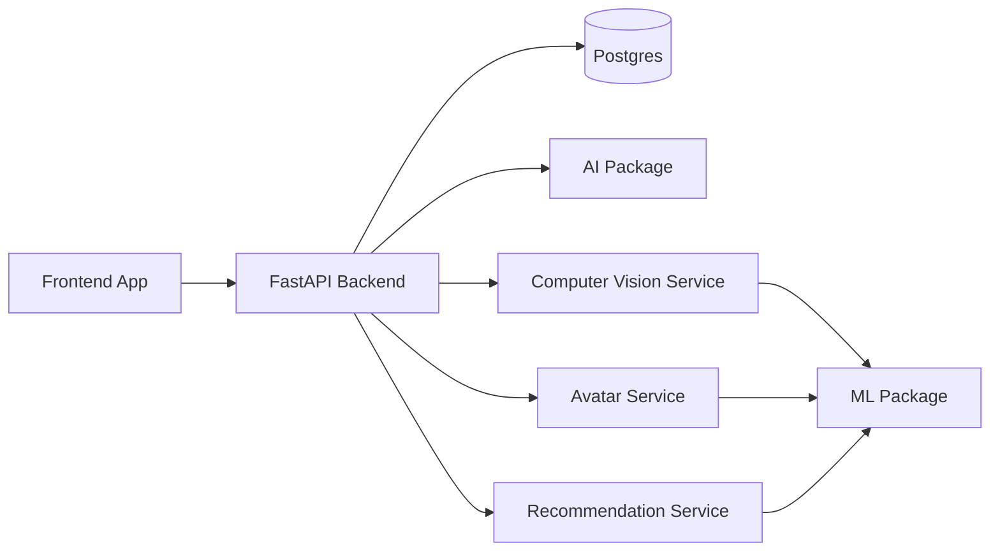
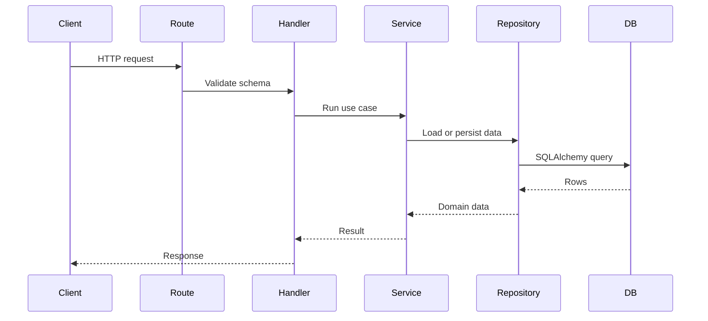

# System Architecture

## Layers

## Backend Pattern

SVEYRA backend follows route, handler, service, repository.

## Independent Boundaries

- `apps/api` exposes product APIs.
- `packages/database` owns schema migrations.
- `packages/ai` owns prompt and model orchestration contracts.
- `packages/ml` owns model adapter contracts.
- `services/cv` owns perception workflows.
- `services/avatar` owns 3D identity and try-on workflows.
- `services/recommendation` owns ranking and styling decisions.

## Request Rule

Routes should stay thin. Handlers coordinate schemas and status codes. Services hold business logic. Repositories are the only layer that talks directly to the database.
