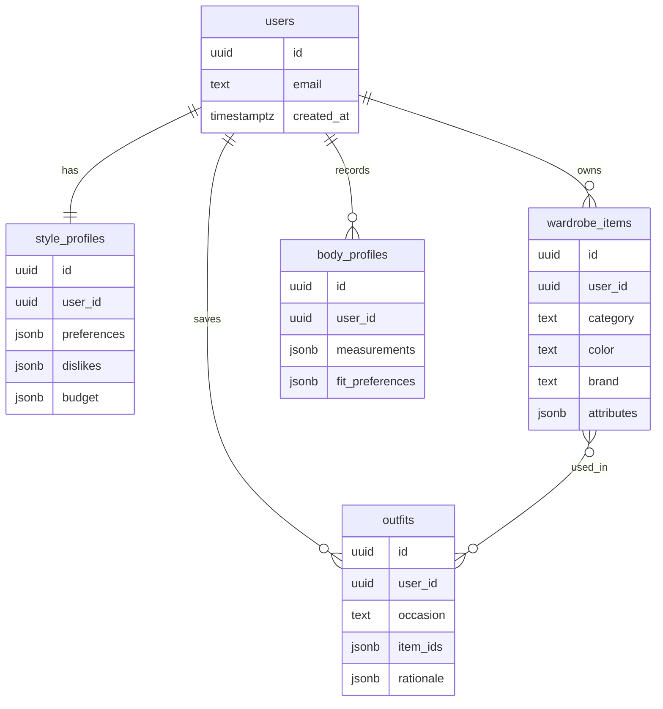

# Database

Default database: PostgreSQL with Alembic migrations.

## First Entities



## Migration Workflow

```powershell
cd packages/database
alembic revision --autogenerate -m "describe change"
alembic upgrade head
```

## Rules

- Store structured unknowns in `jsonb` early, then promote stable fields.
- Keep measurements versioned because body and fit data changes over time.
- Keep AI outputs auditable with prompt version, model version, and rationale.
