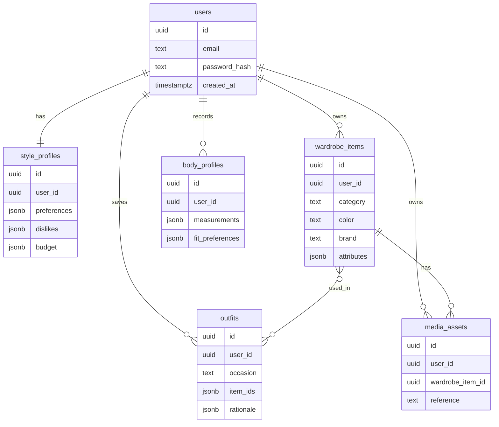

# Database

Default database: PostgreSQL with Alembic migrations.

## First Entities



## Migration Workflow

```powershell
cd database
alembic revision --autogenerate -m "describe change"
alembic upgrade head
```

## Rules

- Store structured unknowns in `jsonb` early, then promote stable fields.
- Keep measurements versioned because body and fit data changes over time.
- Keep AI outputs auditable with prompt version, model version, and rationale.
- `users.password_hash` is the only credential stored in PostgreSQL. Do not store JWTs, plaintext passwords, or access tokens in any table.
- PostgreSQL stores the opaque media reference and ownership metadata; the actual image bytes live in Google Cloud Storage when `STORAGE_BACKEND=gcs`.
- `media_assets.reference` is provider-neutral opaque storage reference only. Do not store GCS URLs, signed URLs, or image bytes there. Signed access URLs are generated at runtime via `GET /v1/media/{asset_id}/access` and are not database data.
- Media deletion removes the metadata record via `DELETE /v1/media/{asset_id}` after object storage deletion through `StoragePort.delete()`. The reference remains opaque in PostgreSQL until the row is removed. The remaining `media_assets` row is the retry record after a partial failure; no extra deletion-state columns are stored.
- Do not put media URLs or image bytes into `wardrobe_items.attributes`.
- Signed URLs are runtime-generated for media access; they are not persisted. CDN remains future work. Upload persists only an opaque `reference` via `StoragePort`. Deletion removes the external object first, then the metadata row; that sequence is not a distributed transaction. Recovery is a retry of the same `DELETE` against the remaining metadata row.
- Occasion recommendations are ephemeral API responses. M17/M19 do not persist recommendation rows; accepted looks may be saved through the existing `outfits` table. Ranking may read existing `style_profiles`, `body_profiles.fit_preferences`, and `wardrobe_items.attributes` (including `attributes.cv`) without schema changes.
- M18 garment enrichment writes only into existing `wardrobe_items.category`, `wardrobe_items.color`, and `wardrobe_items.attributes` (including an `attributes.cv` provenance object). No Alembic migration is required. Never store bytes, signed URLs, or opaque storage references in `attributes`.
- M20 wardrobe `DELETE` removes linked `media_assets` first (storage then metadata, same as M14), then the `wardrobe_items` row. No soft-delete columns. Outfit JSON `item_ids` are not cascaded.
