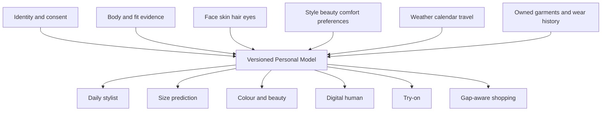

# Product System and First Principles

## North-star outcome

The user opens SVEYRA and receives a small number of trustworthy, personal
actions: what to wear now, how to complete it, which size is most likely to fit,
which colours and beauty choices work together, and what the result may look
like on them. The system improves from confirmations, wears, edits, purchases,
keeps, and returns.

The digital human is infrastructure for identity, measurement, visualization,
and motion. It is not the entire product. Daily usefulness must exist before
the final photoreal reconstruction pipeline is complete.

## First-principles rules

### Evidence before confidence

Every personal or garment attribute belongs to one of these classes:

| Class | Examples | Product treatment |
| --- | --- | --- |
| User-confirmed fact | height, owned item, preferred fit | authoritative until edited |
| Calibrated observation | skin sample under controlled light, scan circumference | store protocol and uncertainty |
| Model estimate | garment category, face landmark, body surface | show confidence and allow correction |
| Preference | comfort, style, makeup intensity, budget | contextual and allowed to change |
| Behaviour signal | worn, skipped, returned, saved | never override an explicit choice silently |

### One person, one versioned Personal Model

Provider outputs are observations attached to the Personal Model, not separate
copies of the person. Re-running a model creates a new observation version and
does not destroy confirmed data.

### Separate visual truth from physical truth

| Question | Minimum evidence |
| --- | --- |
| Does this combination look plausible? | owned/catalog garment image plus person image or digital-human render |
| Does this colour harmonize? | calibrated or confirmed appearance plus garment/product colour |
| Which labelled size is likely? | metric body, category, size chart, preferred ease, brand history |
| Is a region tight or loose? | garment geometry/pattern, material, body surface, cloth simulation |

The UI must show `Suggestion`, `Visual preview`, `Size estimate`, or `Simulated
fit` beside the corresponding output.

## Core product loops

### Onboarding

1. Account, consent, country, units, and accessibility choices.
2. Style goals, occasions, dress codes, comfort, modesty, budget, and dislikes.
3. Appearance profile with user-confirmed skin, undertone, contrast, eyes, hair,
   face, sensitivity, and makeup preferences.
4. Body measurements, size history, fit preferences, and optional guided capture.
5. Add at least five useful garments and confirm detected attributes.
6. Generate the first owned-wardrobe outfit and ask for one reaction.

Onboarding is resumable. Appearance, measurements, and biometric capture are
optional unless required for a specific feature; the user sees what each field
unlocks.

### Daily styling

1. Read current location/weather only with permission.
2. Read selected calendar context only with permission.
3. Combine occasion, dress code, laundry/availability, weather, fit, palette,
   wear history, and explicit preferences.
4. Return three diverse complete looks, not a wall of near-duplicates.
5. Let the user swap one item, adjust warmth/formality/colour, preview, schedule,
   or mark worn.
6. Learn from the explicit reason for rejection or acceptance.

### Wardrobe capture

1. Photograph, import, scan a receipt, or select a known catalog item.
2. Validate focus, lighting, framing, and number of garments.
3. Segment garment from person/background.
4. Detect taxonomy, colours, pattern, material cues, brand/size text, season,
   dress code, silhouette, and confidence.
5. Present an editable review card before committing uncertain values.
6. Generate clean display assets and outfit-ready embeddings asynchronously.

### Shopping

1. Find gaps only from wardrobe coverage, real contexts, and usage.
2. Retrieve compatible products within budget, values, size availability, and
   retailer constraints.
3. Rank by number of owned outfits completed, predicted size, palette, return
   risk, and novelty.
4. Clearly label sponsored results and keep them out of organic ranking inputs.
5. Record purchase, keep/return, and reason to calibrate future results.

### Digital human and try-on

1. Guided, consented capture with scale and quality checks.
2. Reconstruct a metric canonical body and identity appearance.
3. Validate novel views, measurements, rig, skin, hair, and motion.
4. Generate a fast 2D visual try-on when requested and clearly label it.
5. Run metric 3D dressing only when garment geometry/material evidence exists.
6. Expose uncertainty and do not convert visual plausibility into a fit claim.

## Domain ownership

| Domain | Durable entities | Owner |
| --- | --- | --- |
| Identity | users, sessions, consents, deletion/export requests | backend/auth |
| Personal Model | style, body, appearance, evidence, versions | backend/profile |
| Wardrobe | garments, variants, media, detections, wear logs | backend + CV service |
| Styling | contexts, candidates, reasons, reactions, outfits | recommendation service |
| Commerce | products, offers, size charts, wishlists, price events | commerce adapters |
| Human | manifests, captures, mesh/rig/material assets, evaluations | human engine/avatar service |
| Try-on | jobs, inputs, provider evidence, outputs, fit reports | try-on orchestration |

## Product success measures

Measure the whole loop, segmented by device, country, body/skin range, and new
versus established users:

- onboarding completion and time to first useful outfit;
- percentage of wardrobes with enough coverage for recommendations;
- outfit save, schedule, wear, swap, and explicit rejection rates;
- garment detection confirmation/correction rate;
- size recommendation keep rate and avoidable return rate;
- try-on completion, identity/product preservation, and artifact reports;
- colour/makeup suggestion saves and confirmed product matches;
- Personal Model correction rate and confidence calibration;
- deletion/export completion and privacy incidents;
- latency and cost per successful user outcome, not merely per API call.

## Product exclusions until proven

- A perfect clone claim from one photograph.
- Exact measurements from an uncalibrated image.
- Dermatology, skin health, or allergy diagnosis.
- Universal makeup shade matching from shade names alone.
- Physical-fit claims from any generative 2D preview.
- Children/minors in biometric capture or generated try-on before dedicated
  policy, consent, safety, and legal review.

