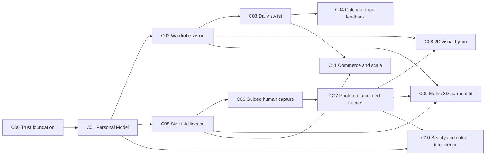

# Execution Checkpoints

This is the ordered delivery backlog. Status reflects the repository on
2026-09-07. `DONE` means acceptance evidence exists in the repository;
`PARTIAL` means usable foundations exist but the checkpoint gate is not met.

## Dependency map

## Task completion contract

Every task must include:

- strict request/response or domain schema and versioning strategy;
- authorization, ownership, input limits, and shared error envelope;
- migration with one Alembic head when durable data changes;
- deterministic unit tests plus integration tests at provider boundaries;
- loading, empty, success, correction, retry, and error UI states;
- event/metric names without raw biometric or secret data;
- accessibility keyboard/focus/contrast checks;
- updated checkpoint status and linked evidence report.

## C00 - Trust and platform foundation (`PARTIAL`)

**Goal:** safe boundaries exist before personal images or external models scale.

**Dependencies:** none.

- [x] `C00-T01` JWT identity and ownership isolation for product APIs.
- [x] `C00-T02` Private media abstraction with opaque storage references.
- [x] `C00-T03` Provider-neutral `VisionPort`, `StylistPort`, `ShoppingPort`, and
  avatar boundary foundations.
- [ ] `C00-T04` Add versioned consent grants by purpose: profile, appearance,
  biometric reconstruction, generated try-on, improvement dataset, sharing.
- [ ] `C00-T05` Add raw/derived media classes, retention policies, deletion jobs,
  export jobs, and audited access reasons.
- [ ] `C00-T06` Add job/outbox infrastructure for image, reconstruction, and
  try-on work; requests must be idempotent and retry-safe.
- [ ] `C00-T07` Add feature flags, provider routing, per-user quotas, budgets,
  kill switches, and model/version audit records.
- [ ] `C00-T08` Define supported countries, age gate, privacy review, incident
  response, and abuse reporting before external biometric processing.

**Gate:** deleting a user removes or schedules deletion of every raw and derived
asset; a test account can export its data; provider calls are attributable to a
consent, purpose, model version, and cost record.

## C01 - Personal Model and onboarding (`PARTIAL`)

**Goal:** one editable, evidence-aware source of truth feeds every feature.

**Dependencies:** `C00-T01` through `C00-T05` for production release.

- [x] `C01-T01` Style and body/fit profile persistence.
- [x] `C01-T02` Appearance profile API for skin, undertone, contrast, face, eyes,
  hair, makeup preferences, evidence, and deterministic palette.
- [x] `C01-T03` Color Studio web route without raw JSON editing.
- [ ] `C01-T04` Create `PersonalModelSummary` API with section completion,
  source/confidence, last confirmed time, and feature unlocks.
- [ ] `C01-T05` Replace remaining profile JSON fields with guided controls,
  examples, unit selection, validation, and privacy explanations.
- [ ] `C01-T06` Build resumable onboarding orchestration and progress storage.
- [ ] `C01-T07` Add evidence records per field rather than one profile-level
  evidence object; preserve confirmed values when new estimates arrive.
- [ ] `C01-T08` Build Today dashboard: next best action, model completion,
  wardrobe readiness, weather/context, and first outfit.

**Gate:** a new user can pause/resume, understand why each input is requested,
confirm or reject all estimates, and reach a useful outfit without entering JSON.

## C02 - Wardrobe capture and garment identification (`PARTIAL`)

**Goal:** convert imperfect photos into accurate, editable garment records.

**Dependencies:** `C00`, stable garment taxonomy, storage lifecycle.

- [x] `C02-T01` Wardrobe CRUD, media upload/access/delete, ownership isolation.
- [x] `C02-T02` Enrichment contract and deterministic stub behind `VisionPort`.
- [ ] `C02-T03` Define versioned garment taxonomy for category, subcategory,
  silhouette, length, neckline, sleeve, rise, closure, and intended layer.
- [ ] `C02-T04` Add client capture-quality checks: blur, exposure, cropping,
  occlusion, multiple garments, and readable label guidance.
- [ ] `C02-T05` Implement segmentation/background removal and retain masks as
  derived, deletable assets.
- [ ] `C02-T06` Implement schema-validated attribute extraction: primary and
  secondary colours, pattern, material cues, season, dress code, style tags,
  brand, labelled size, care and composition OCR, confidence per field.
- [ ] `C02-T07` Build side-by-side review UI with low-confidence highlights,
  fast corrections, taxonomy search, and undo.
- [ ] `C02-T08` Create clean closet imagery, thumbnails, dominant colour in
  calibrated spaces when possible, and multimodal search embeddings.
- [ ] `C02-T09` Support batch import, duplicate detection, receipts/email with
  separate consent, catalog match, and processing status.
- [ ] `C02-T10` Create labelled evaluation set across garment types, colours,
  patterns, lighting, bodies, backgrounds, and cultural clothing.

**Gate:** the benchmark meets the signed quality thresholds in the evaluation
document; every field is correctable; original and derived assets honor deletion.

## C03 - Daily stylist and outfit intelligence (`PARTIAL`)

**Goal:** produce a small, diverse set of explainable, context-correct outfits.

**Dependencies:** `C01`, sufficient wardrobe coverage from `C02`.

- [x] `C03-T01` Deterministic recommendation contract, saved outfits, and basic
  occasion input.
- [ ] `C03-T02` Define outfit grammar: base, bottom/one-piece, layer, shoes, bag,
  accessories, beauty; enforce compatibility and optionality by context.
- [ ] `C03-T03` Implement candidate retrieval and scoring for dress code,
  weather, colour, proportion, comfort, availability, repetition, and preference.
- [ ] `C03-T04` Add diversity reranking so the top results differ materially.
- [ ] `C03-T05` Generate reason codes first; optional natural-language wording
  must not invent unsupported fit, ownership, weather, or colour claims.
- [ ] `C03-T06` Build swap/refine controls: warmer, cooler, more formal, less
  revealing, different colour, different shoes, and exclude one item.
- [ ] `C03-T07` Capture saved/skipped/worn/rejected plus explicit reason and use
  it as a bounded preference signal.

**Gate:** offline fixtures are deterministic; constraint violation rate is zero;
users can explain and reverse learned preferences.

## C04 - Calendar, weather, trips, and repeat use (`PARTIAL`)

**Goal:** turn styling into a daily habit without excessive data access.

**Dependencies:** `C03`.

- [x] `C04-T01` Basic outfit calendar route.
- [ ] `C04-T02` Calendar OAuth with read-minimum scopes, event selection, and
  disconnect/deletion behaviour.
- [ ] `C04-T03` Weather adapter using coarse location by default and cached
  forecasts with timezone correctness.
- [ ] `C04-T04` Today feed, notifications, laundry/availability, wear logging,
  and plan changes.
- [ ] `C04-T05` Trip builder with destinations, multi-day weather, dress codes,
  packing coverage, rewear, laundry, and baggage constraints.
- [ ] `C04-T06` Shareable outfit/lookbook that never exposes private profile or
  biometric evidence.

**Gate:** revoking calendar/location permission leaves the core closet usable;
date/time/weather tests cover supported locales.

## C05 - Body and brand-size intelligence (`PARTIAL`)

**Goal:** predict likely labelled size with calibrated uncertainty.

**Dependencies:** `C01`, garment/category vocabulary, evaluation data.

- [x] `C05-T01` Body parameter model and measurement/profile foundations.
- [ ] `C05-T02` Version measurement evidence with unit, method, posture, date,
  uncertainty, and user confirmation.
- [ ] `C05-T03` Define normalized brand size chart, garment measurement, pattern,
  stretch, ease, and region-specific label contracts.
- [ ] `C05-T04` Implement category-specific size rules using body, garment/chart,
  preferred ease, and brand/return history.
- [ ] `C05-T05` Return top size, alternatives, reasons, missing evidence,
  confidence, and `cannot_recommend` when evidence is insufficient.
- [ ] `C05-T06` Capture ordered size, kept/returned, reason, and comfort by region;
  recalibrate per brand without learning protected traits.
- [ ] `C05-T07` Benchmark by category, brand, body range, region, and uncertainty.

**Gate:** size recommendations are calibrated and outperform a size-chart-only
baseline without hiding the `cannot_recommend` population.

## C06 - Guided metric human capture (`PARTIAL`)

**Goal:** obtain sufficient evidence for a measurable, identity-specific human.

**Dependencies:** `C00`, `C01`, `C05` measurement contract.

- [x] `C06-T01` Canonical watertight body topology, UVs, portable skin, and
  parameter deformation foundation.
- [ ] `C06-T02` Mobile/web capture protocol for body turn, close face views,
  neutral expression, known scale, clothing/hair guidance, and consent.
- [ ] `C06-T03` On-device pose/face/framing/blur/exposure/coverage quality checks.
- [ ] `C06-T04` Camera calibration, multi-view association, segmentation,
  landmarks, silhouettes, and optional depth ingestion.
- [ ] `C06-T05` Fit canonical identity shape to views with regional confidence
  and measured-versus-inferred evidence.
- [ ] `C06-T06` Version manifests and assets; allow recapture without breaking
  saved outfits or size history.

**Gate:** held-out scans meet signed surface/measurement thresholds and failures
request recapture instead of producing confident but unsupported geometry.

## C07 - Photoreal, animated digital human (`PARTIAL`)

**Goal:** preserve identity across view, lighting, expression, and human motion.

**Dependencies:** `C06`.

- [ ] `C07-T01` High-resolution face and ears; complete eyes, lids, mouth cavity,
  teeth, tongue, nails, hands, and feet.
- [ ] `C07-T02` Lighting-neutral PBR skin with albedo, normal/displacement,
  roughness, subsurface, lips, eyes, and calibrated tone rendering.
- [ ] `C07-T03` Hair representation covering geometry, colour, density, hairline,
  curl/coiling, eyebrows, lashes, facial/body hair, and runtime LOD.
- [ ] `C07-T04` Body, fingers, gaze, eyelids, jaw, tongue, and at least the agreed
  facial blendshape contract; add corrective and soft-tissue deformation.
- [x] `C07-T05` Initial collision-aware limb constraints and developer viewer.
- [ ] `C07-T06` Joint-limit library, self-collision, balance/contact, foot plant,
  retargeting, lip-sync, and temporal stability evaluation.
- [ ] `C07-T07` Web/mobile renderer LODs, streaming, cache, fallback, and quality
  controls with photoreal lighting references.

**Gate:** identity, anatomy, motion, and rendering scorecards pass across the
evaluation cohort; the UI still labels regions with insufficient evidence.

## C08 - Fast 2D visual try-on (`PLANNED`)

**Goal:** provide useful visual outfit previews while preserving honest labels.

**Dependencies:** `C00`, `C02`; preferably `C07` for stable person source renders.

- [ ] `C08-T01` Define `TryOnPort` inputs, jobs, outputs, provider metadata,
  moderation, cost, idempotency, and deletion semantics.
- [ ] `C08-T02` Build a private offline benchmark using real consented people and
  products; compare Vertex and at least one fallback/baseline.
- [ ] `C08-T03` Spike Vertex `virtual-try-on-001` through the server-side adapter;
  never expose credentials or send unconsented media.
- [ ] `C08-T04` Normalize person and product source images, quality gates, masks,
  retry/fallback, result storage, and C2PA/AI disclosure preservation.
- [ ] `C08-T05` Add compare, regenerate, report artifact, delete, and share controls.
- [ ] `C08-T06` Score person identity, body shape, skin tone, garment identity,
  logo/pattern/length, occlusion, hands, shoes, and demographic gaps.

**Gate:** only outputs passing safety and quality thresholds are shown; all are
labelled `AI visual preview - not a fit guarantee`.

## C09 - Metric 3D garment fit and cloth (`PLANNED`)

**Goal:** answer fit/ease/motion questions using physical evidence.

**Dependencies:** `C02`, `C05`, `C06`, and stable human collision from `C07`.

- [ ] `C09-T01` Garment digital-asset contract: panels/pattern, seam graph,
  grading, labelled size, material, thickness, collision layer, and provenance.
- [ ] `C09-T02` Build garment-to-body registration, dressing, collision,
  simulation, caching, and deterministic failure reporting.
- [ ] `C09-T03` Generate ease, pressure/strain, hem, drag, collision, and
  range-of-motion reports by anatomical region.
- [ ] `C09-T04` Validate against physical garments, scans, wear trials, and expert
  annotations across body and material ranges.
- [ ] `C09-T05` Build 3D compare UI with evidence inspector and no false precision.

**Gate:** validated fit reports meet signed thresholds; garments missing patterns
or material data cannot receive a simulated-fit badge.

## C10 - Advanced colour, makeup, hair, and accessories (`PARTIAL`)

**Goal:** recommend and preview a complete appearance, not clothing alone.

**Dependencies:** `C01`; `C07` for photoreal preview.

- [x] `C10-T01` Starter undertone/depth/contrast palette and makeup guidance.
- [ ] `C10-T02` Calibrated multi-sample skin/eye/hair colour capture with quality,
  body location, illuminant, device profile, uncertainty, and confirmation.
- [ ] `C10-T03` Product shade/material model using measured colour, opacity,
  finish, formula, coverage, oxidation notes, and catalog evidence.
- [ ] `C10-T04` Outfit + makeup + hair + metals + accessories recommendation with
  occasion, preference, sensitivity, and product availability.
- [ ] `C10-T05` Face-region makeup renderer for base, concealer, blush, contour,
  highlight, eyes, brows, lips, finish, and intensity with editable layers.
- [ ] `C10-T06` Hair/accessory geometry or provider preview, collision, occlusion,
  and diverse hair/skin evaluation.
- [ ] `C10-T07` Ingredient preference/allergen warnings from verified product
  data; never diagnose and always show manufacturer source/date.

**Gate:** calibrated colour tests and human evaluation pass across the cohort;
product suggestions never claim allergy safety or exact match without evidence.

## C11 - Commerce, mobile, and production scale (`PARTIAL`)

**Goal:** close the planning-to-purchase loop with transparent economics.

**Dependencies:** `C03`, `C05`, provider/privacy readiness.

- [x] `C11-T01` Wardrobe gap and stub shopping contracts.
- [ ] `C11-T02` Catalog, offer, inventory, size-chart, retailer, affiliate, and
  price-history adapters with canonical product/variant identity.
- [ ] `C11-T03` Organic ranking separated from sponsorship; disclosure and audit.
- [ ] `C11-T04` Wishlist, price alerts, alternatives, availability, deep links,
  attribution, purchase/return feedback, and stale-offer handling.
- [ ] `C11-T05` Mobile capture/daily client, notifications, offline queue, upload
  resume, and low-bandwidth modes.
- [ ] `C11-T06` Production SLOs, autoscaling, queue backpressure, GPU capacity,
  disaster recovery, support tooling, fraud/abuse controls, and cost dashboards.

**Gate:** load/security/privacy reviews pass, offers are fresh and attributable,
and provider failure leaves core owned-wardrobe features usable.

