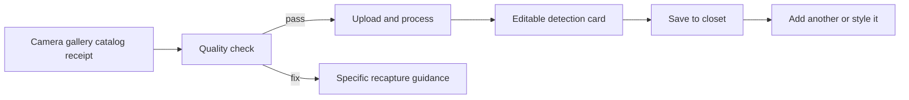

# UI and UX Flows

## Experience direction

The product should feel like a calm personal studio, not an admin dashboard.
Use photography and the user's garments as the visual center. Expose advanced
evidence only when requested, but never hide uncertainty or generated-media
labels.

Design traits:

- editorial composition, generous space, strong typography, restrained colour;
- one primary action per view and progressive disclosure for complex capture;
- direct manipulation for swaps, colours, calendar placement, and try-on;
- plain labels such as `Confirmed by you`, `Estimated from 3 photos`, and
  `Missing garment measurements`;
- responsive web first, with capture flows designed for a future mobile client;
- no raw JSON fields, internal IDs, storage keys, or provider names in normal UI.

## Information architecture

### Primary navigation

| Destination | Purpose |
| --- | --- |
| Today | daily outfit, weather/context, next action, reminders |
| Closet | garments, search, filters, capture/import, wear state |
| Style | outfit creation, recommendations, saved looks, calendar, trips |
| Try On | visual preview and, when available, evidence-backed 3D fit |
| Shop | gaps, wishlist, alternatives, price and size evidence |
| You | Personal Model, Color Studio, body/size, digital human, privacy |

On narrow screens use five tabs: `Today`, `Closet`, central `Create`, `Try On`,
and `You`; put calendar/trips/shop under contextual entry points and `More`.

Developer-only routes, including Human Engine evidence tools, live under a
clearly marked `Developer` area and are unavailable in production user builds.

## Global shell

- Header: current destination, optional context/date, search, notifications,
  profile/privacy menu.
- Desktop: compact left navigation and content canvas; avoid nested sidebars.
- Mobile: bottom navigation, full-width cards, persistent primary action where
  it helps capture or review.
- Toasts report transient success only. Durable failures stay beside the action
  with retry and diagnostic reference.
- Skeletons preserve layout. Empty states teach the first useful action.
- Generated images always carry a visible disclosure near the image, not only in
  terms or metadata.

## Flow 1 - First run and onboarding

```text
Welcome
  -> account and minimum consent
  -> goals and contexts
  -> style/fit preferences
  -> appearance and Color Studio
  -> optional measurements/capture
  -> add five garments
  -> first outfit
  -> reaction and Today
```

### Screen requirements

1. **Welcome**: outcome examples, time estimate, `Start`, `Explore first`.
2. **Consent**: separate purpose toggles and plain retention summary; no bundled
   consent for digital human, external try-on, or model improvement.
3. **Goals**: multi-select occasions and goals; `Skip` remains visible.
4. **Style and fit**: visual cards plus searchable terms; comfort and modesty are
   independent of gender labels.
5. **Appearance**: user selects or confirms skin depth/undertone, eyes, hair,
   contrast, face and makeup preferences; explain photo limitations.
6. **Body**: choose manual measurements, known sizes, guided capture, or later.
7. **Closet starter**: five-item progress with suggested coverage, not five
   arbitrary items.
8. **First result**: complete outfit, reasons, missing piece, swap, save, wear.

Persist after every step. A returning user lands on the first incomplete useful
step and can navigate backward without losing confirmed data.

## Flow 2 - Add a garment from a photo



### Capture view

- Source choices: photograph flat/hanging garment, select gallery, scan label,
  find catalog item, or add manually.
- Live guides: one garment, full item visible, neutral background preferred,
  avoid severe shadow/glare, include a second label photo for brand/size/fabric.
- Show which quality check failed instead of a generic `bad image` message.
- Upload displays progress and can resume; leaving the screen does not duplicate
  a job.

### Detection review

- Left/top: cleaned garment image with original toggle and crop/mask correction.
- Right/bottom: category, subtype, colours, pattern, material, brand, size,
  season, dress code, silhouette and notes.
- Each inferred field shows confidence only when useful: `Looks right`, `Check
  this`, or numeric detail in Evidence view.
- Low-confidence fields open automatically; confirmed high-confidence fields stay
  compact.
- Colour uses named swatch plus device-rendered sRGB and optional calibrated
  Lab/OKLCH details. User can sample another region.
- `Save` is allowed with unknown fields. Never force a guess.

### Processing states

`queued -> quality_check -> segmenting -> identifying -> review_required ->
ready`, with terminal `failed` and recoverable `needs_new_photo`. The closet card
may appear immediately with its current state.

## Flow 3 - Closet

- Default gallery emphasizes clean item imagery and recent/useful items.
- Search accepts category, colour, material, brand, dress code, season, and a
  natural-language intent translated to filters.
- Filters are chips with clear-all and result count; sort by recent, most worn,
  least worn, colour, category, and season.
- Item detail: images/evidence, attributes, size/fit history, outfits, wear logs,
  care, availability/laundry, edit, reprocess, archive/delete.
- Multi-select powers packing lists, outfit creation, bulk season/availability,
  and deletion confirmation.

## Flow 4 - Today and recommendations

The hero answers `What should I wear?` with one primary outfit and two
meaningfully different alternatives.

Each look includes:

- item stack and optional beauty/accessory plan;
- context chips for weather, occasion, dress code, comfort and availability;
- short reason codes rendered as natural language;
- `Wear`, `Save`, `Swap`, `Try on`, `Schedule`, and `Not for me`;
- missing-item action only when it materially improves several looks.

`Not for me` opens bounded reasons: colour, fit/comfort, too warm/cold, too
formal/casual, too revealing, repeated recently, dislike item, or other. A
single rejection should not permanently ban a style without confirmation.

## Flow 5 - Outfit builder

- Start from recommendation, garment, blank canvas, inspiration image, or event.
- Slot rail: base, bottom/one-piece, layer, shoes, bag, accessories, beauty.
- Closet results are filtered by slot and context; user can temporarily relax a
  rule.
- Canvas supports replace, remove, reorder layer, compare, undo/redo, and save.
- Explain conflicts such as unavailable item or weather mismatch without blocking
  creative choices.
- `Complete this look` searches owned items first and shopping second.

## Flow 6 - Color Studio and beauty

### Current slice

The `/appearance` route edits confirmed skin tone/depth/undertone/sensitivity,
face, eyes, hair, contrast, and makeup preference, then shows deterministic
starter palette, combinations, metals, and makeup guidance.

### Target flow

1. Choose `Manual`, `Guided photo`, or later `Instrument measurement`.
2. Guided photo checks neutral lighting, exposure, white balance reference, no
   colour filter, face regions, and device profile availability.
3. Review multiple sampled regions and uncertainty; confirm a representative
   baseline instead of one magic pixel.
4. Explore clothing palette by colour families, lightness, chroma, contrast, and
   combinations; allow likes/dislikes and exceptions.
5. Build beauty look by occasion and intensity. Edit complexion, cheeks, eyes,
   brows, lips, finish and product constraints separately.
6. Preview on calibrated photo or digital human with `visual preview` label.
7. Save the look and connect products/owned items when exact catalog evidence is
   available.

Sensitivity/allergen controls filter or warn using verified product ingredients;
they never claim a product is medically safe.

## Flow 7 - Body, size, and digital human

### Body and size

- Entry shows measurements, source, date, confidence, and supported features.
- Add paths: manual tape guide, known garment/brand sizes, professional scan,
  guided capture.
- Result compares likely sizes with reasons and missing evidence; user can set
  preferred ease by category and body region.
- A large `Update` action is shown when measurements are stale or conflicting.

### Guided human capture

- Preflight: privacy/retention, space, clothing, hair, lighting, camera, scale.
- Body turn uses pose/framing/coverage coaching and hands/feet visibility.
- Face capture collects neutral and expression sequence plus profiles.
- Review shows accepted/missing views and allows selective retake.
- Processing screen is asynchronous; notification is optional.
- Result begins with identity comparison and measurement review before cosmetic
  rendering controls.

### Developer Human Engine

The developer route shows mesh wireframe/surface, skeleton, joint names/limits,
body parameters, measurements, collision volumes, regional confidence, asset
manifest, pose library, and acceptance-gate issues. It must support stable deep
links for a body preset and pose so defects are reproducible.

## Flow 8 - Try On

1. Choose person source: approved photo or current digital-human render.
2. Choose one supported product variant/size and verify image quality.
3. Select result type:
   - `Fast visual preview` for generated 2D appearance;
   - `Size estimate` when size-chart evidence exists;
   - `3D simulated fit` only when garment geometry/material evidence exists.
4. Show queue/progress, cancellation where provider permits, and cost/credit if
   consumer pricing applies.
5. Result offers before/after, compare variant, inspect evidence, save, share,
   report artifact, and delete.

The three result types may appear together but never share one ambiguous score.

## Flow 9 - Calendar and trips

- Calendar drag/drop outfit with conflict and weather alerts.
- Event import is opt-in per calendar and can exclude titles/descriptions while
  retaining time and user-selected dress code.
- Trip wizard: locations/dates, activities, weather, laundry, baggage, rewear.
- Output: daily looks, compact packing list, missing essentials, and alternatives.

## Design system requirements

- Tokenize neutral surfaces, semantic feedback, typography, spacing, radius,
  shadow, motion, focus, and data-confidence colours.
- Do not use skin-tone colours as generic success/error semantics.
- Every swatch includes text and accessible name; never communicate only by hue.
- Minimum touch target 44 by 44 CSS pixels; visible keyboard focus; logical tab
  order; reduced-motion mode; zoom and screen-reader checks.
- User photography uses controlled aspect ratios and `object-fit`; faces and
  garments cannot be distorted to fill cards.
- Use view transitions sparingly; capture guidance can animate only when it
  materially teaches movement.

## Responsive acceptance matrix

Test every critical flow at 360, 390, 768, 1024, 1440, and 1920 CSS-pixel widths,
plus keyboard-only and 200% zoom. Test dark/high-contrast preferences only after
tokens and photography presentation are intentionally designed for them.

## Required states per screen

| State | Requirement |
| --- | --- |
| First use | explains value and first action |
| Loading | preserves layout and identifies long-running jobs |
| Partial data | remains useful and names what additional data unlocks |
| Low confidence | requests confirmation or recapture |
| Provider unavailable | retry/fallback without losing inputs |
| Offline/interrupted | queued/resumable where applicable |
| Permission denied | core manual path remains usable |
| Delete | exact affected assets and recovery window where offered |
| Empty | action-oriented, never a dead dashboard |

