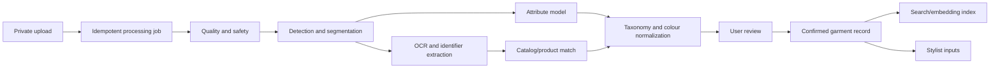

# Wardrobe Vision and Stylist

## Outcome

A wardrobe item becomes a trustworthy, searchable garment record from one or
more imperfect inputs. The stylist then combines owned items using explicit
constraints, personal preferences, colour/fit evidence, and context.

Vision proposes; the user confirms. The original image, clean display image,
segmentation mask, OCR, catalog match, inferred fields, and confirmed garment
record have distinct provenance and lifecycles.

## Garment input modes

| Mode | Best for | Evidence limitations |
| --- | --- | --- |
| Flat/hanger photo | shape, colour, pattern, clean imagery | fit and drape on body unknown |
| Garment worn by user | silhouette, styling, approximate drape | segmentation/occlusion harder |
| Label/care photo | brand, size, composition, care, identifiers | does not show garment shape |
| Receipt/email import | brand, name, SKU, price | requires separate consent and catalog lookup |
| Catalog link/search | exact product/variant imagery and metadata | may be stale or wrong variant |
| Manual entry | privacy and correction fallback | slower and sparse |

Allow multiple evidence assets per garment. A label image supplements rather
than replaces the primary garment image.

## Canonical garment schema

### Identity and ownership

- stable wardrobe item ID and user ownership;
- catalog product and variant IDs when matched, with match confidence;
- brand, line/name, SKU/barcode, labelled size, region, colourway;
- acquisition date/source, price/currency, current availability state;
- original, derived, and preferred display asset IDs.

### Taxonomy and construction

- department/presentation only when useful and user-editable;
- category/subcategory and outfit slot;
- silhouette/fit, intended layer, length, sleeve, neckline/collar, rise, leg,
  waist, closure, pockets, heel/toe and accessory-specific fields;
- primary/secondary/accent colours with spatial coverage;
- pattern, motif/logo placement, texture, transparency and sheen;
- fabric/material composition from verified label/catalog versus visual cues;
- season, warmth, water/wind response, dress codes, style tags;
- care instructions and alterations.

Do not force every category into one giant flat schema. Use a stable common core
plus versioned category-specific attributes validated at the service boundary.

### Fit and physical evidence

- labelled size and size system;
- garment measurements and measurement method;
- pattern/panel/seam/grading asset references when licensed;
- stretch direction/range, thickness, weight, bending/shear cues, lining;
- user fit notes by body region and kept/returned result;
- source/confidence for each value.

## Processing architecture



### Job rules

- `POST` returns `202` and stable job ID for expensive work.
- Idempotency key prevents duplicate storage and provider cost.
- Each stage records adapter/model/version, input asset version, latency, cost,
  error code, and derived asset IDs.
- Retry only transient failures. Invalid/low-quality input returns specific
  recapture guidance.
- Results from an older input/model remain auditable but cannot silently overwrite
  confirmed fields.
- Workers access bytes through `StoragePort`; browser and product routes never
  receive cloud credentials.

## Vision pipeline

### Stage 1 - Input quality and safety

Detect:

- MIME/decode validity, dimensions, file size, malicious payload indicators;
- blur, motion, exposure/clipping, mixed light, crop, perspective and background;
- zero/one/multiple garments, person presence, prohibited/unsafe content;
- visible label/text regions and image reuse/duplicate hash.

Outputs are quality measurements plus actionable failures such as `show the full
left sleeve` or `photograph one garment at a time`.

### Stage 2 - Detection, segmentation, and clean image

- detect all garments and accessory instances;
- identify primary target or ask the user to select one;
- produce alpha mask with edge quality for lace, straps, hair-like fringe,
  transparency, holes and shadows;
- preserve original geometry; background removal must not shorten hems or sleeves;
- store original, mask, crop transform, cleaned image and thumbnail separately;
- allow brush/erase or boundary correction and regenerate derived assets.

### Stage 3 - OCR and catalog identity

- crop labels, care tags, logos, barcodes and receipt text;
- OCR with bounding boxes/language/confidence;
- normalize brand aliases, size systems, composition and care symbols;
- use barcode/SKU/catalog search where available;
- require confirmation when image and catalog colourway/variant conflict;
- retain raw OCR as derived evidence, not as confirmed product metadata.

### Stage 4 - Attribute extraction

Return a strict JSON schema with per-field confidence and evidence region:

- category/subcategory/outfit slot;
- shape/construction attributes applicable to that category;
- colour regions in display RGB and perceptual colour space when calibrated;
- pattern, texture, material cues, transparency and sheen;
- season/warmth/dress-code/style tags;
- logo/motif only when confident and permitted;
- ambiguity and alternative candidates.

A multimodal foundation model can assist schema extraction, but category-specific
models/rules and a domain benchmark remain necessary. Free-form prose is never
written directly into authoritative garment fields.

### Stage 5 - Product and duplicate matching

Match against the user's wardrobe first, then an owned/authorized catalog:

- perceptual image embeddings plus normalized metadata;
- exact barcode/SKU/variant evidence outranks visual similarity;
- return ranked matches and score components;
- never auto-merge on embedding similarity alone;
- Cloud Vision Product Search is a candidate for matching within an indexed
  apparel catalog, not a complete garment understanding system.

## Review and correction policy

Use three bands determined from validation, not arbitrary model confidence:

- **auto-filled**: high precision, still editable;
- **check this**: visible prompt before completion;
- **unknown**: do not guess; offer search/manual value.

Store both the proposed value and user correction. Corrections may enter an
improvement dataset only under separate consent, de-identification policy, and
dataset governance.

## Search and closet intelligence

Support:

- structured filters on confirmed fields and qualified estimates;
- hybrid semantic + keyword + taxonomy retrieval;
- natural-language query compiled into auditable filters;
- outfit graph: item co-wears, compatible slots, rejected combinations;
- wear frequency, last worn, laundry/availability, cost per wear;
- coverage by weather, occasion, dress code and outfit slot;
- duplicate/near-duplicate and neglected-item insights.

Search results must show when a match relies on an uncertain inferred field.

## Stylist architecture

```text
Context builder
  -> hard-constraint filter
  -> candidate retrieval
  -> outfit grammar assembly
  -> feature scoring
  -> diversity reranking
  -> reason-code generation
  -> optional language rendering
  -> feedback event
```

### Hard constraints

- item belongs to user or explicitly selected catalog source;
- item is available/clean and not excluded;
- required outfit slots and dress code are satisfied;
- weather safety and user-defined modesty/comfort limits;
- explicit dislikes/bans and size availability for shopping;
- no unsupported physical-fit claim.

An LLM cannot override these constraints.

### Scoring features

- contextual suitability: weather, occasion, dress code, activity, travel;
- outfit structure: slot coverage, layer order, silhouette/proportion rules;
- colour: palette affinity, contrast, harmony, user exceptions;
- comfort/fit: known user feedback and predicted ease confidence;
- personal preference: explicit signals weighted above implicit behaviour;
- wardrobe utility: underused items, rewear spacing, laundry/availability;
- novelty/diversity: avoid returning the same template repeatedly;
- commerce: owned items outrank purchasing; gaps require durable evidence.

Keep sponsored/affiliate value entirely outside organic relevance scoring.

### Explanation contract

Create structured reason codes such as:

```json
{
  "code": "COLOUR_CONTRAST_MATCH",
  "evidence": ["appearance_profile:v3", "wardrobe_item:..."],
  "strength": 0.78,
  "message_key": "outfit.reason.colour_contrast"
}
```

Optional natural language is rendered from reason codes. It cannot invent facts
and should say `based on your confirmed...` or `estimated...` where relevant.

## Feedback model

Capture event plus explicit reason and context:

- viewed, saved, scheduled, worn, repeated, shared;
- item swapped/removed/added and order of operations;
- rejected due to colour, comfort, fit, formality, temperature, repetition,
  modesty, dislike or unavailable item;
- shopping click, purchase, size ordered, keep/return and reason;
- corrected garment field.

Use event version and source. Apply bounded updates, let users inspect learned
preferences, and provide reset/undo. Non-action is weak evidence.

## Provider contract expansion

The current `VisionPort.analyze_garment(bytes)` is intentionally small. Evolve it
without leaking an SDK into routes:

```text
GarmentVisionPort
  assess_quality(asset)
  segment(asset, target_hint)
  extract_attributes(asset_set, taxonomy_version)
  extract_label(asset)
  embed(asset, record)

CatalogMatchPort
  match_identifiers(identifiers)
  search_visual(asset, filters)
  get_variant(product_id, variant_id)
```

Each response includes provider, model/version, latency, confidence calibration
version, moderation outcome and cost metadata.

## Evaluation set and launch gates

Build a rights-cleared, versioned benchmark with:

- tops, bottoms, one-pieces, layers, underwear/swim where policy permits, shoes,
  bags, jewellery/accessories, uniforms and cultural clothing;
- sizes/body presentation, flat/hanger/worn, folds, occlusion, clutter, multiple
  items, difficult backgrounds and lighting;
- dark/light/low-chroma/saturated colours, multicolour, prints, transparency,
  lace, sequins, reflective and textured materials;
- common and long-tail brands/labels/languages/size systems;
- expert-confirmed taxonomy, masks, colours, OCR and product identity.

Report category macro/micro F1, mask IoU and boundary quality, colour difference,
OCR field accuracy, exact variant retrieval, confidence calibration, manual
correction rate, latency, provider failure and cost. Thresholds must be signed in
`08_PRIVACY_EVALUATION_OPERATIONS.md` before production routing.

