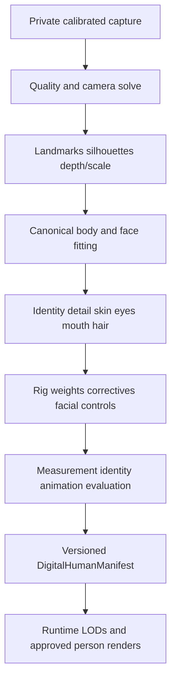

# Digital Human, Size, and Try-On

## Truth layers

SVEYRA must keep four layers separate even when they share one screen:

1. **Body evidence** - measurements, scans, images, calibration and uncertainty.
2. **Digital human** - versioned identity geometry, rig, materials and hair.
3. **Size estimate** - likely label derived from body, chart/garment and preference.
4. **Try-on result** - either generated visual preview or metric cloth simulation.

The external 2D try-on provider is not the body model. The canonical digital
human remains SVEYRA-owned, provider-neutral, and versioned.

## Body evidence model

Every measurement stores:

- anatomical definition and stable vocabulary;
- numeric value/unit and uncertainty interval;
- method: user tape, professional scan, calibrated reconstruction, garment/size
  history estimate, or uncalibrated photo estimate;
- posture, breathing/landmark convention where relevant;
- source evidence IDs, date, protocol, model/version and user confirmation;
- conflicts with other versions and which version is active for each feature.

Do not merge incompatible methods by averaging. A size model may use a posterior
distribution, but the UI must retain the source values and disagreement.

## Size intelligence

### Inputs

- current body measurement distributions;
- product variant and region-specific brand size chart;
- actual garment measurements when available;
- category, cut, stretch/material and intended layer;
- user-preferred ease and comfort by category/body region;
- known owned sizes plus keep/return/wear feedback;
- measurement recency and current uncertainty.

### Output contract

```json
{
  "recommended_size": "M",
  "alternatives": [{"size": "L", "tradeoff": "more waist ease"}],
  "confidence": 0.73,
  "fit_by_region": [{"region": "chest", "assessment": "close"}],
  "evidence": ["body_profile:v4", "size_chart:brand:2026-08-01"],
  "missing_evidence": ["garment_hip_measurement"],
  "reasons": ["CHART_CHEST_MATCH", "PREFERRED_EASE_MATCH"],
  "is_fit_guarantee": false
}
```

When the required chart/garment evidence is missing, return
`cannot_recommend` or a clearly weak estimate. Do not always force a size.

### Size-chart normalization

- brand, market/region, product/category, fit/cut, gendered label only as catalog
  metadata, alpha/numeric/cup/waist-inseam/shoe systems;
- measurement definitions, range endpoints, units and source URL/document date;
- body-size chart versus garment-measurement chart distinction;
- stretch/ease assumptions and brand notes;
- variants and overrides for petite/tall/plus/maternity/adaptive ranges;
- staleness and manual review status.

## Digital human capture

### Production evidence

- guided full-body turn video or calibrated multi-view set;
- known height, calibration target or trustworthy depth/scale;
- neutral pose in close-fitting clothing with hands and feet visible;
- close face front, profiles and intermediate angles;
- neutral expression plus expression/gaze/jaw sequence;
- optional dedicated hair capture and reference images;
- explicit purpose-specific biometric consent and retention choice.

A single image can initialize a low-confidence preview but cannot pass the metric
or identity acceptance gate because unseen geometry and body-under-clothing are
inferred.

### Capture quality checks

- pose/framing/turn coverage and anatomical visibility;
- camera motion, rolling shutter, blur, exposure and focus;
- lighting stability and face/skin colour quality;
- clothing looseness, occlusion and hair covering required regions;
- scale/calibration target validity;
- face identity consistency and one-person session integrity;
- supported device/camera metadata.

On-device MediaPipe pose/face landmarks are candidates for coaching and coverage,
not metric 3D ground truth.

## Reconstruction pipeline



### Geometry

- stable watertight canonical body with metric scale and UVs;
- topology-preserving identity and body deformation;
- high-detail face/ears, hands/fingers/nails, feet/toes;
- separate complete eyes and eyelids, mouth cavity, teeth and tongue;
- anatomical regions and collision proxies aligned with measurement vocabulary;
- multiple deterministic LODs with correspondence to the canonical surface.

### Appearance

- lighting-neutral base colour; normal/displacement; roughness/specular;
- subsurface skin parameters and spatial variation;
- physically plausible cornea/iris/sclera/tear line;
- lip/oral/nail materials and non-destructive makeup layers;
- strand/card/validated neural hair with geometry-aware shadow/occlusion;
- regional evidence and confidence rather than hallucinated uniform detail.

### Rig and motion

- body, spine, clavicle, scapula, fingers/toes, eyes, eyelids, jaw and tongue;
- facial blendshape/control contract plus identity-specific correctives;
- anatomical joint limits with coupled shoulder/clavicle/scapula and forearm twist;
- self-collision capsules/SDF or mesh collision for torso, arms, hands, thighs;
- balance, ground contact, foot plant, grasp/contact and penetration correction;
- soft-tissue/skin deformation and volume preservation;
- retargeting, temporal filters, lip-sync and expression blending.

The existing collision-aware canonical viewer is a development baseline, not a
complete biomechanical simulator.

## DigitalHumanManifest

The manifest should include:

```text
identity/version/consent reference
capture and reconstruction protocol versions
canonical units/axes/rest pose/topology and LODs
mesh, UV, rig, skin weights and corrective assets
face control vocabulary
material/texture/hair assets
measurements and regional evidence/confidence
collision proxies and motion constraint version
approved renderer/camera/lighting settings
evaluation report and acceptance issues
third-party file provenance and commercial rights
opaque storage references and retention class
```

Never embed raw photos, public URLs or secrets in the manifest.

## Fast 2D visual try-on

### Purpose

Answer `How might this garment combination look?` quickly using a person source
image/render and product image. This is useful before garment patterns exist.

### Provider-neutral contract

```text
TryOnRequest
  person_asset_id + approved appearance/human version
  product_variant_id + product_asset_id
  optional garment mask/category
  output count and policy/context
  consent grant and idempotency key

TryOnResult
  output asset IDs
  provider/model/version/region
  input versions, safety status, generated-media credentials
  identity/product quality scores
  latency/cost and expiration/deletion status
  result_type = generated_visual_preview
  fit_guarantee = false
```

### Vertex candidate

Google Vertex AI `virtual-try-on-001` is the primary integration candidate as of
2026-09-07. It accepts a person image and product image and produces generated
images. It must be benchmarked for SVEYRA garments, identities and regions before
launch. Provider model retirement information means the adapter and stored model
version are mandatory; do not place its request shape in product routes.

Do not state that Alta uses Vertex without reliable public evidence. Our provider
selection is independent.

### Input strategy

Prefer an approved, consistent digital-human render when it scores better than an
ordinary photo for identity/body preservation. Also benchmark user photos because
providers may be optimized for real imagery. Standardize:

- full body or relevant crop, neutral pose, hands clear, consistent aspect ratio;
- clean single product image and exact variant/colourway;
- category support and masks where provider accepts them;
- no compositing across people or product variants;
- source image retention and consent before sending externally.

### Output checks

- person identity, body proportions, skin/hair tone and face preservation;
- product category, colour, print/logo, construction, sleeve/hem and material cues;
- hand/arm/leg occlusion, layering, footwear, accessories and background artifacts;
- safety/moderation, watermark/content credentials and generation disclosure;
- perceptual duplicate and corrupted output rejection.

Failed outputs are withheld or clearly flagged; generation retries are bounded to
control cost.

## Metric 3D garment fit

### Garment asset contract

- exact product/variant/size and source rights;
- metric 2D patterns or validated 3D geometry;
- panel names, grain, seams, darts, closures, elastic and layer order;
- grading between labelled sizes;
- thickness, density, stretch, shear, bend, friction and damping;
- collision thickness and body/garment contact groups;
- texture/normal/roughness/opacity plus logo/print placement;
- source, version, uncertainty and physical validation evidence.

A catalog photograph alone is insufficient for this contract.

### Simulation pipeline

1. Select exact metric body/human version and pose.
2. Select exact garment variant/size and validated asset version.
3. Register garment landmarks/pattern to body and initialize dressing.
4. Resolve layer order and collision without tunneling/intersection.
5. Simulate gravity and material; reach stable state.
6. Run agreed motion set: stand, sit, walk, reach, bend, squat, arm raise.
7. Compute garment ease, distance, pressure/strain proxies, hem movement,
   collision and failure flags by region.
8. Render results and create an evidence report with uncertainty.

### Fit result labels

- `size estimate`: based on body/chart/history;
- `static simulated fit`: based on validated 3D garment/body in one pose;
- `motion simulated fit`: validated across the supported motion set;
- `insufficient garment evidence`: visual preview only.

Avoid false millimetre precision in consumer UI. The developer evidence view may
show numeric maps with method and uncertainty.

## Evaluation gates

### Human reconstruction

- body/face surface error against rights-cleared scans;
- measurement error and repeatability across sessions;
- novel-view identity similarity plus blinded human review;
- skin/hair/eye colour and material under standardized lights;
- anatomy completeness, topology, UV, rig and LOD conformance;
- expression, lip-sync, gaze, hand/foot and motion temporal stability;
- penetration, joint-limit violation, foot slide and volume loss;
- performance/error slices across supported bodies, skin, hair, devices and dress.

### Size

- coverage, top-1/top-2 accuracy, calibration and `cannot_recommend` rate;
- keep/return and comfort-by-region against chart-only baseline;
- results per brand/category/size system/body range and evidence quality.

### 2D try-on

- identity/body and garment/variant preservation;
- geometric/artifact failure and moderation rates;
- user preference without confusing preview with fit;
- latency, availability and cost per accepted output;
- parity gaps across supported cohorts and garment categories.

### 3D fit

- geometry registration, collision and stable simulation success;
- pressure/strain/ease correlation with instrumented or expert physical trials;
- hem/landmark error and motion outcome;
- honest refusal rate where garment evidence is inadequate.

