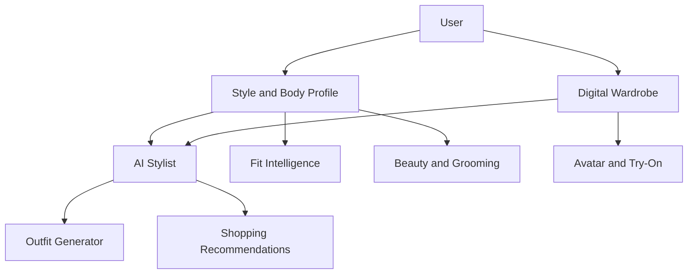

# SVEYRA Product Requirements

## Vision

SVEYRA becomes the user's digital style extension. It understands what they own, how they look, what fits, where they are going, what they like, and what they should buy next.

## Core Users

- People who want daily outfit guidance.
- Shoppers who struggle with sizing, fit, and styling.
- Fashion-forward users who want discovery without losing personal context.
- Brands that need better fit, styling, and personalization signals.

## MVP Outcomes

- User can create a style profile.
- User can add wardrobe items with images and metadata.
- User can ask what to wear for an occasion.
- User can receive outfit recommendations using owned items.
- User can save fit preferences and measurements.
- System can explain why an outfit works in simple language.

## Later Outcomes

- Personalized 3D avatar.
- 2D and 3D virtual try-on.
- Brand-aware sizing intelligence.
- Beauty, skin, hair, and grooming recommendations.
- Commerce recommendations linked to wardrobe gaps.

## Product Modules

## Non-Goals For First Build

- Production-grade cloth physics.
- Fully automated body measurement from one image.
- Direct checkout integration.
- Model training pipelines beyond documented contracts.
